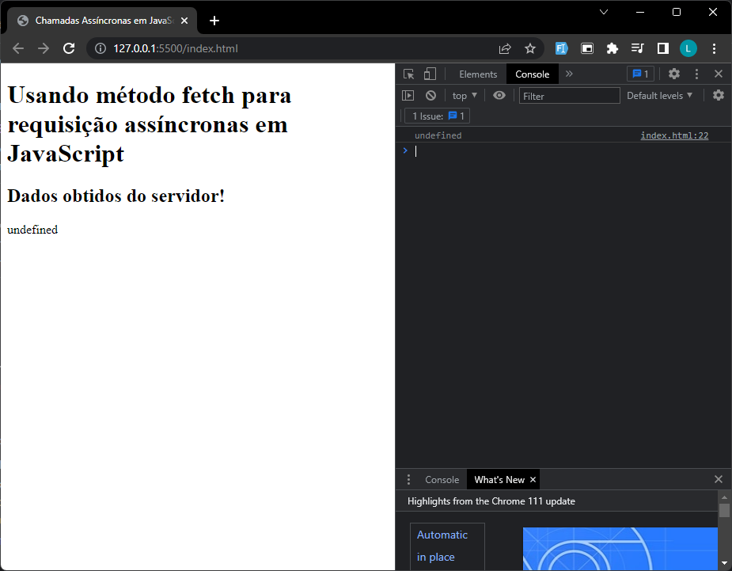
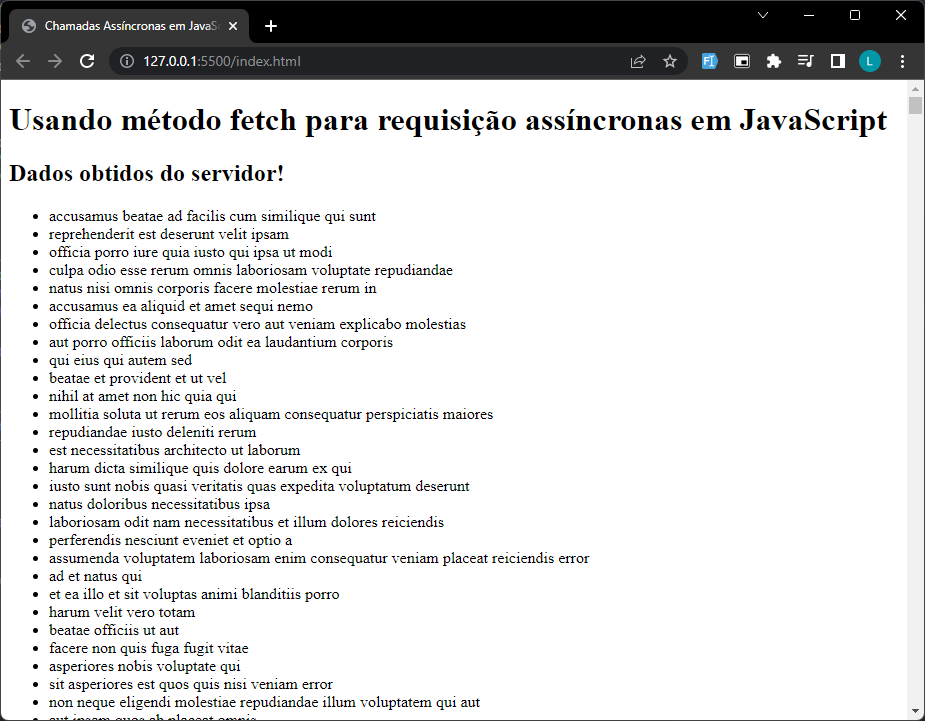

# Chamadas Assíncronas em JavaScript

Uma das formas de minimizar os problemas de escalabilidade e evitar o bloqueio de aplicações cliente e servidoras é fazer requisições assíncronas, que não bloqueiam a execução da aplicação enquanto uma resposta não for obtida.

Tal técnica permite que a aplicação possa continuar executando outras tarefas enquanto uma resposta não chega. Isto não reduz o tempo de resposta, mas aumenta a escalabilidade do sistema justamente por ele não ficar parado à espera de uma resposta.

No [vídeo anterior](https://youtu.be/FoZXsJcjiTc?t=442) foi mostrado um código HTML/JavaScript para realizar requisições assíncronas usando recursos nativos e modernos de JavaScript, sem depender de nenhuma biblioteca.

Crie um repositório no GitHub com o código mostrado e altere a URL da requisição enviada para um servidor remoto para https://jsonplaceholder.typicode.com/photos. Tal URL irá retornar uma grande lista de endereços de fotos, que demora um pouco mais para ser obtida.

No código apresentado, inclua uma nova div acima de `<div id="dados">` e no final da tag script, obviamente usando JavaScript, exiba a mensagem `"<h2>Dados obtidos do servidor!</h2>"` em tal tag.

No repositório no GitHub, adicione um arquivo README.md e relate:
1. Qual problema percebeu ao realizar tais alterações;
2. Explique porque o problema ocorreu e o qual a relação com chamadas assíncronas;
3. Altere o código para resolver o problema.

## Código mostrado no vídeo para realizar requisições assíncronas

```HTML
<!DOCTYPE html>
<html lang="pt-BR">
<head>
    <meta charset="UTF-8">
    <meta http-equiv="X-UA-Compatible" content="IE=edge">
    <meta name="viewport" content="width=device-width, initial-scale=1.0">
    <title>Chamadas Assíncronas em JavaScript</title>
</head>
<body>
    <main>
        <h1>Usando método fetch para requisição assíncronas em JavaScript</h1>
        <div id="dados"></div>
    </main>

    <script>
        async function request() {
            const response = await fetch('https://pokeapi.co/api/v2/pokemon');
            const object = await response.json();
            document.querySelector('#dados').innerHTML = JSON.stringify(object);
        }

        request();
    </script>
</body>
</html>
```

## Código modificado

```HTML
<!DOCTYPE html>
<html lang="pt-BR">
<head>
    <meta charset="UTF-8">
    <meta http-equiv="X-UA-Compatible" content="IE=edge">
    <meta name="viewport" content="width=device-width, initial-scale=1.0">
    <title>Chamadas Assíncronas em JavaScript</title>
</head>
<body>
    <main>
        <h1>Usando método fetch para requisição assíncronas em JavaScript</h1>
        <div id="resultados"></div>
        <div id="dados"></div>
    </main>

    <script>
        async function request() {
            const response = await fetch('https://jsonplaceholder.typicode.com/photos')
            const { results } = await response.json()

            document.querySelector('#dados').innerHTML = JSON.stringify(results)
        }

        request()

        document.querySelector('#resultados').innerHTML = '<h2>Dados obtidos do servidor!</h2>'
    </script>
</body>
</html>
```


## Qual problema percebeu ao realizar tais alterações;
Os dados não chegaram a tempo do JavaScript inseri-los na variável e depois apresentá-los. Por conta disso, o que foi apresentado foi um dado indefinido.


## Explique porque o problema ocorreu e o qual a relação com chamadas assíncronas;
O código continuou a ser executado mesmo sem esperar o retorno da resposta da API. Isso fez com que o valor apresentado não fosse o resultado obtido da API, pois quando a linha de inserir dados no HTML foi executada ainda não haviam dados.

## Altere o código para resolver o problema.
```HTML
<!DOCTYPE html>
<html lang="pt-BR">
<head>
    <meta charset="UTF-8">
    <meta http-equiv="X-UA-Compatible" content="IE=edge">
    <meta name="viewport" content="width=device-width, initial-scale=1.0">
    <title>Chamadas Assíncronas em JavaScript</title>
</head>
<body>
    <main>
        <h1>Usando método fetch para requisição assíncronas em JavaScript</h1>
        <div id="resultados"></div>
        <div id="dados"></div>
    </main>

    <script>
        // Solicitar dados da API
        const request = async () => {
            const API_URL = 'https://jsonplaceholder.typicode.com/photos'
            const response = await fetch(API_URL)

            return await response.json()
        }

        // Montar e obter lista HTML com os dados obtidos 
        const getHTMLListFromData = (data) => {
            let list = '<ul>'
                
            data.forEach(element => list += `<li>${element.title}</li>`)

            return list += '</ul>'
        }

        // Obtendo os dados da API e apresentando em lista
        request().then(results => document.querySelector('#dados').innerHTML = getHTMLListFromData(results))

        document.querySelector('#resultados').innerHTML = '<h2>Dados obtidos do servidor!</h2>'
    </script>
</body>
</html>
```

